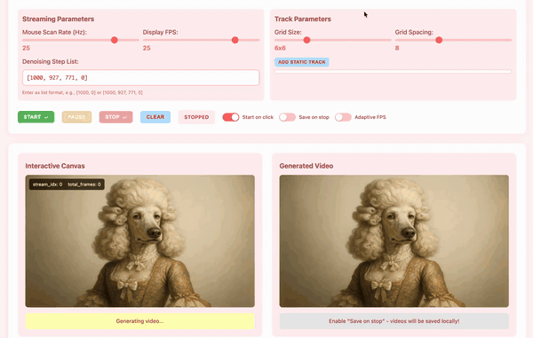

<div align="center">

# MotionStream: Real-Time Video Generation with Interactive Motion Controls

[Joonghyuk Shin](https://joonghyuk.com/)<sup>1,3</sup> · [Zhengqi Li](https://zhengqili.github.io/)<sup>1</sup> · [Richard Zhang](https://richzhang.github.io/)<sup>1</sup> · [Jun-Yan Zhu](https://www.cs.cmu.edu/~junyanz/)<sup>2</sup> · [Jaesik Park](https://jaesik.info/)<sup>3</sup> · [Eli Shechtman](https://research.adobe.com/person/eli-shechtman/)<sup>1</sup> · [Xun Huang](https://www.xunhuang.me/)<sup>1</sup>

<sup>1</sup>Adobe Research · <sup>2</sup>Carnegie Mellon University · <sup>3</sup>Seoul National University

[](https://arxiv.org/abs/2511.01266)
[](https://joonghyuk.com/motionstream-web/)



</div>

---

## Code Release

> **Note:** The code is currently under the company's internal review for open-sourcing. While we are working on it, we have not yet received a firm timeline, and the release may or may not occur depending on the outcome of the review. Since our models, data, and codebase are based on open-source resources, we hope researchers can reproduce our results using the methodology and implementation details described in the paper. If not approved, we will use this place to share some of the evaluation data and model outputs. Feel free to open an issue or contact me (joonghyuk@snu.ac.kr) with any questions. We'll keep this README updated if anything changes :)

## Citation

```bibtex
@article{shin2025motionstream,
  title={MotionStream: Real-Time Video Generation with Interactive Motion Controls},
  author={Shin, Joonghyuk and Li, Zhengqi and Zhang, Richard and Zhu, Jun-Yan and Park, Jaesik and Schechtman, Eli and Huang, Xun},
  journal={arXiv preprint:2511.01266},
  year={2025}
}
```
